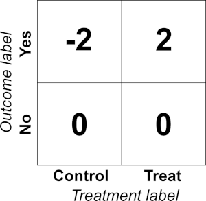

.. role:: raw-latex(raw)
   :format: latex
..

Introduction to uplift
======================

In traditional binary classification, we attempt to predict a binary
outcome :math:`y` based on some set of features :math:`X`. Consequently, our
success criterion is usually something that measures how well we can
predict :math:`y` based on values of :math:`X` (e.g. accuracy, precision,
recall). In uplift modeling, however, the story is quite different,
because while we are still trying to predict the outcome :math:`y`, we want
to predict this outcome *conditioned* on a treatment. In other words, we
want to find individuals for whom the *effect* of our treatment is
largest.

To understand the practical ramifications of this constraint, consider a
simple decision tree model. In a decision tree, splits are chosen to
maximize the homogeneity of nodes. In the context of advertising, for an
outcome model, this would mean finding splits that separate those who
would visit our website from those who wouldn’t. In uplift modeling, the
split needs to be chosen to take into effect the treatment, and so, we
want to sort out those who would visit our website only when shown an ad
(serving an ad is useful) from those who would visit our website
regardless (serving an ad is useless).

The conceptually simplest way to do this is to change the splitting
criterion, but because many of ``sklearn``\ ’s built-in implementations
do not allow for a custom split criterion/optimization function, this is
not completely trivial. While we could recreate each method to allow for
this customized uplift criterion (and others have done this), we have
discovered that ``sklearn`` is blazingly fast, and in making a homebrew
algorithm, we’d sacrifice some of the benefits (efficient hyperparameter
tuning) that come with speed (the other algorithms we have encountered
are, regrettably, slow). Thus, we seek alternate methods that allow us
to leverage ``sklearn`` (and other) modules. In particular, we implement
methods here that simply transform the data, but code the
Treatment/Control information in the transformed outcome.

The Transformed Outcome
-----------------------

Our package by default implements the Transformed Outcome (Athey 2016)
method, defined as:

.. math:: Y^{*} = Y \frac{W - p}{p(1-p)}

where :math:`Y^{*}` is the Transformed Outcome, :math:`Y` is the outcome (1
or 0), :math:`W` indicates the presence of a treatment (1 or 0), and :math:`p
= P(W=1)` (the treatment policy). When :math:`p = 0.5`, this amounts to
labelling (treatment, outcome) pairs as follows:

The beauty of this transformation is that, in expectation,

.. math:: E[Y^{*}] = P(Y | W=1) - P(Y | W=0),

or uplift. Any algorithm trained to predict :math:`Y^{*}`, then, gives a
prediction of uplift.

The Qini curve
--------------

Once the model has been made, evaluation is traditionally accomplished
using what is known as a Qini curve. The Qini curve is defined as

.. math:: \text{Qini curve}(\phi) = \frac{n_{t,y=1}(\phi)}{N_t} - \frac{n_{c,y=1}(\phi)}{N_c}

where :math:`\phi` is the fraction of population treated (in
either treatment :math:`t` or control :math:`c`, as indicated by the subscripts) ordered by predicted uplift (from highest to lowest). We use lowercase :math:`n` to indicate a :math:`\phi`-dependent count, and the uppercase :math:`N` to indicate a total count (i.e. :math:`n(1)`).
“Random chance” is therefore a model that cannot distinguish positive
and negative uplift and results in a straight line from :math:`(0,0)` to

.. math::

   \left(1, \frac{N_{t,y=1}}{N_t} -
   \frac{N_{c,y=1}}{N_c}\right).

The value ``Q`` is then the area between the model’s Qini curve and the
random chance Qini curve. ``Q`` has been used throughout the literature
as a way of measuring how good a model is at separating positive and
negative uplift values. However, a problem with this curve that its
absolute value is dependent on how people generally respond to your
treatment. Consequently, it is not particularly useful in understanding
how much of the *potential* uplift you have captured with your model. To
this end, we generally normalize ``Q`` in a two different ways:

-  ``q1``: ``Q`` normalized by the theoretical maximal area.
-  ``q2``: ``Q`` normalized by the practical maximal area.

The theoretical maximal curve corresponds to a sorting in which we
assume that an individual is persuadable (uplift = 1) if and only if
they respond in the treatment group (and the same reasoning applies to
the control group, for sleeping dogs). The practical max curve
corresponds to a similar sorting, for which we also assume that all
individuals that have a positive outcome in the treatment group must
also have a counterpart (relative to the proportion of individuals in
the treatment and control group) in the control group that did not
respond. This is a more conservative, realistic curve. The former can
only be attained through overfitting, while the latter can only be
attained under very generous circumstances. Within the package, we also
calculate the “no sleeping dogs” curve, which simply precludes the
possibility of negative effects.

To evaluate ``Q``, we predict the uplift for each row in our dataset. We
then order the dataset from highest uplift to lowest uplift and evaluate
the Qini curve as a function of the population targeted. The area
between this curve and the x-axis can be approximated by a Riemann sum
on the :math:`M` data points:

.. math:: \text{Qini Curve Area} = \sum_{i=0}^{M-1} \frac{1}{2}\left(\text{Qini curve}(\phi_{i+1})+\text{Qini curve}(\phi_{i})\right)\left(\phi_{i+1} - \phi_{i}\right)

where

.. math:: \phi_{i} = i/M,

and so

.. math:: \text{Qini Curve Area} = \sum_{i=0}^{M-1} \frac{1}{2}\left(\frac{n_{t,y=1}(\phi_{i+1})-n_{t,y=1}(\phi_{i})}{N_t} - \frac{n_{c,y=1}(\phi_{i+1})-n_{c,y=1}(\phi_i)}{N_c}\right)\frac{1}{M}

We then need to subtract off the randomized curve area which is given
by:

.. math:: \text{Randomized Qini Area} = \frac{1}{2}\left(\frac{N_{t,y=1}}{N_t} - \frac{N_{c,y=1}}{N_c}\right)

and so the Qini coefficient is:

.. math:: Q = \text{Qini Curve Area} - \text{Randomized Qini Area}

Alternate Qini-style curves
---------------------------

Unfortunately, with the Transformed Outcome method, there is a real risk
of overfitting to the ``treatment`` label. In this case, the Qini curve
as defined above could give values that are deceptively inflated. To
correct for this, we implemented two alternate Qini-style curves. First,
the **Cumulative Gain Chart** (Gutierrez 2017) finds the lift within the
subset of the population up to :math:`\phi`, then multiplies
this by :math:`n_t(\phi) + n_c(\phi)` to scale the resulting lift to the scale of global impact:

.. math:: \mbox{Cumulative gain}(\phi) = \left( \frac{n_{t,1}(\phi)}{n_t(\phi)} - \frac{n_{c,1}(\phi)}{n_c(\phi)} \right) \left( n_t(\phi) + n_c(\phi) \right).

In our formulation, we multiple by :math:`\phi` instead, as follows, so the y-axis matches the y-axis of the Qini curves.

.. math:: \mbox{Cumulative gain}(\phi) = \left( \frac{n_{t,1}(\phi)}{n_t(\phi)} - \frac{n_{c,1}(\phi)}{n_c(\phi)} \right) \frac{\left( n_t(\phi) + n_c(\phi) \right)}{N_t + N_c}.

Note we simplified the notation, replacing :math:`y=1` above with simply
:math:`1` in the subscripts of :math:`n`.

.. math:: \mbox{Cumulative gain}(\phi) = \left( \frac{n_{t,1}(\phi)}{n_t(\phi)} - \frac{n_{c,1}(\phi)}{n_c(\phi)} \right) \left( n_t(\phi) + n_c(\phi) \right).

Alternatively, we also implement what we call the **Adjusted Qini
curve**, which we define as follows:

.. math:: \mbox{Adjusted Qini}(\phi) = \frac{n_{t,1}(\phi)}{N_t} - \frac{n_{c,1}(\phi) n_t(\phi)}{n_c (\phi) N_t}

We emphasize that the cumulative gains chart is less biased than the
adjusted Qini curve, but the adjusted Qini can be useful when the
percentage targeted is small and treatment group members are valued
disproportionately higher. In such a case, the adjusted Qini overvalues
treatment group information to prevent overspending.

**References**

Athey, S., & Imbens, G. W. (2015). Machine learning methods for
estimating heterogeneous causal effects. stat, 1050(5).

Gutierrez, P., & Gérardy, J. Y. (2017, July). Causal Inference and
Uplift Modelling: A Review of the Literature. In International
Conference on Predictive Applications and APIs (pp. 1-13).

